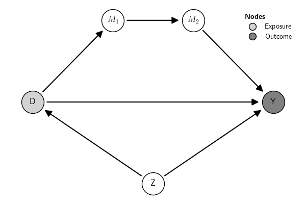

** Preambule :noexport:
#+NAME: save-plot
#+BEGIN_SRC python :exports results :results output raw :tangle src-scm.py :cache no :noweb yes :session *Python* :var fn=""
import matplotlib.pyplot as plt
from causalinf import options as opt
opt.set_options(show_plot=False)
# Save figures
fns = ["./tables-and-figures/" + f"{fn}.png",
       "./tables-and-figures/" + f"{fn}.pdf"]
[plt.savefig(fn) for fn in fns]
plt.close('all')

print(# "#+begin_src org \n"# # # 
      # "#+ATTR_ORG: :width 200/250/300/400/500/600\n"
      # "#+ATTR_LATEX: :width 1\textwidth :placement [ht!]\n"
      # "#+CAPTION: Comparing performance for pivot_wide()\n"
      # "#+Name: fig-pivot-wide\n"
      f"[[./tables-and-figures/{fn}.png]]\n"
      # "#+end_src\n"# # # 
)
#+END_SRC

#+RESULTS: save-plot
[[./tables-and-figures/.png]]

** Usage

The ~examples()~ class creates pre-defined GCMs. To see the examples available, use:

# 
#+BEGIN_SRC python :exports both :results output code :tangle src-gcm-examples.py :cache yes :noweb no :session *Python* :linenums 1 :eval always
from causalinf import gcm

gcm.examples()
#+END_SRC

#+RESULTS[09854997c2e2127341f7c890294ca47598f80550]:
#+begin_src python

List of available examples:
--------------------------        
1. Not identifiable
2. One confounder
3. Two confounders
4. Front-door
5. IV with 1 instrument
6. IV with 3 instruments
7. SoO, IV, and do identified with 1 confounder
8. Mediation: 2 sequential 1 confounder
9. Pearl Example 1.1 (a)
10. Pearl Example 1.1 (b)
11. Pearl Example 1.2
12. Pearl Example 1.3 (a)
13. Pearl Example 1.3 (b)
14. Pearl Example 3.1
15. Pearl Example 3.4
16. Pearl Example 3.5

Usage: examples(which='<example name>')
Example: G = examples(which='Pearl Example 3.5')
Note: To print the associated DAG of each example, use examples(print_DAG=True)
#+end_src

To get one of the pre-defined examples, use their description. Here is one example:

# 
#+BEGIN_SRC python :exports both :results output code :tangle src-gcm-examples.py :cache yes :noweb no :session *Python* :linenums 1 :eval always
G = gcm.examples('Front-door')
print(G)
#+END_SRC

#+RESULTS[d84ed4fbfe3021053143086b13a8ac7b78fdfc49]:
#+begin_src python
Graph:
Z -> Y
U -> Y
D -> Z
Z2 -> D
Z2 -> Y
U -> D
Observed: Z2, Z
Exposure: D
Outcome: Y
Latent: U
#+end_src

# 
#+BEGIN_SRC python :exports results :results silent :tangle src-gcm-examples.py :cache yes :noweb no :session *Python* :linenums 1 :eval always
G.plot()
#+END_SRC

#+CALL: save-plot(fn="gcm-example-of-examples-frontdoor") 

#+RESULTS:
[[./tables-and-figures/gcm-example-of-examples-frontdoor.png]]

Here is another example:

# 
#+BEGIN_SRC python :exports both :results output code :tangle src-gcm-examples.py :cache yes :noweb no :session *Python* :linenums 1 :eval always
G = gcm.examples('Mediation: 2 sequential 1 confounder')
print(G)
#+END_SRC

#+RESULTS[83f37d08959bebbf005bfc8a0bb4da80619c9b4c]:
#+begin_src python
Graph:
Z -> Y
D -> M1
D -> Y
M2 -> Y
M1 -> M2
Z -> D
Observed: M2, M1, Z
Exposure: D
Outcome: Y
#+end_src

# 
#+BEGIN_SRC python :exports results :results silent :tangle src-gcm-examples.py :cache yes :noweb no :session *Python* :linenums 1 :eval always
G.plot()
#+END_SRC

#+CALL: save-plot(fn="gcm-example-of-examples-two-sequential-mediators") 

#+RESULTS:

