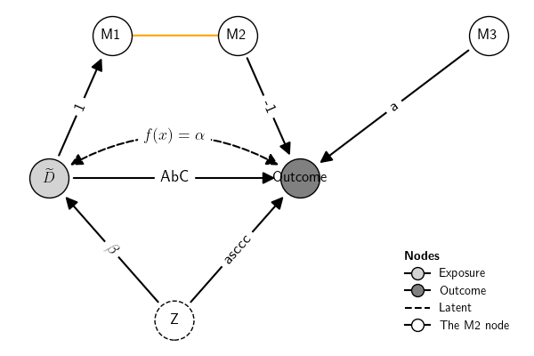
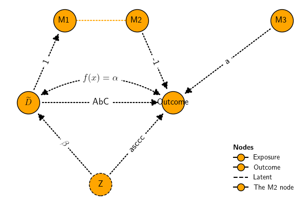
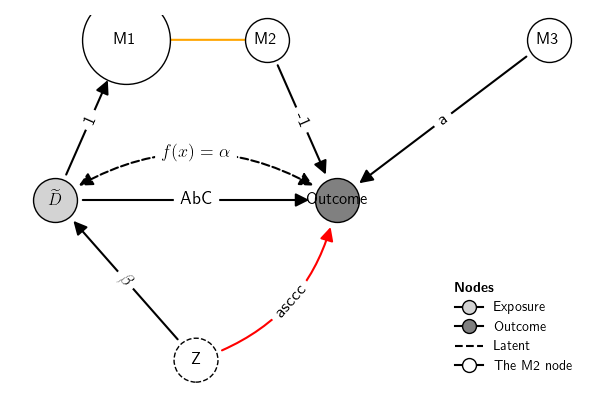
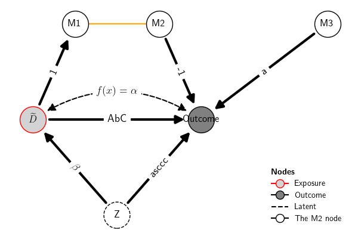

## Examples

### Full example

The example below shows how to

1.  Create a DAG using a string `dag` and the function `DAG`
2.  Set the nodes\' positions using a dictionary `pos`
3.  Set roles of the nodes (Exposure, Outcome, etc.) using a dictionary
    `roles`
4.  Set labels for nodes using a dictionary `node_labels`, including
    with LaTeX expressions
5.  Set labels for the edges using a dictionary `edge_labels`, including
    with LaTeX expressions
6.  Customize nodes and edges visual features

``` {.python exports="both" results="silent" tangle="src-gcm-DAG.py" cache="yes" noweb="no" session="*Python*" linenums="1" eval="always"}
from causalinf import gcm

dag  = '''
D -> {M1, Y}   # Defines two directed edges: D->Y and D->M1
M1 -- M2       # Defines an undirected edge b/w M1 and M2
M2 -> Y        # Defines one directed edge from M2 to Y
M3 -> Y
D <-> Y        # Defines a bidirected edge b/w D and Y
Z -> {D, Y}
'''
pos = {'D': (0,0),
       'Y': (1,0),
       'Z': (.5, -1),
       'M1': (.25, 1),
       'M2': (.75, 1),
       'M3': (1.75, 1),
       }
roles = {'Exposure'    : "D",
         'Outcome'     : "Y",
         "Latent"      : 'Z',
         "The M2 node" : "M2" # arbtiraty roles available
         }
node_labels = {"D": "$\widetilde{D}$",
               'Y': "Outcome"}
edge_labels = {
    # directed edge labels
     ('D', 'M1') : 1,
     ('M2', 'Y') : -1,
     ('M3', 'Y') : 'a',
     ('D', 'Y') : 'AbC',
     ('Z', 'D') : '$\\beta$',
     ('Z', 'Y'): 'asccc',
     # bidirected edge label
     (('D', 'Y'), ('Y', 'D')): '$f(x)=\\alpha$',
     # undirected edge label
     ( 'M1', 'M2' ) : 1234, # 
     ( 'M2', 'M1' ) : 1234, # 
}

G = gcm.DAG(dag, nodes_label=node_labels, nodes_position=pos, edge_label=edge_labels, nodes_role=roles)
G.plot()
```



### Visual features all at once

Features of nodes and edges can be customized by the name of the edge or
node, their type, or all at once. To customize all at once (for example,
with color for nodes and line style for edges):

``` {.python exports="both" results="silent" tangle="src-gcm-DAG.py" cache="yes" noweb="no" session="*Python*" linenums="1" eval="always"}
G.plot(node_color="orange", edge_style='dotted')
```



### Visual features by name

To customize by name of nodes and edges, say node M1 and edge
$Z \to Y $:

``` {.python exports="both" results="silent" tangle="src-gcm-DAG.py" cache="yes" noweb="no" session="*Python*" linenums="1" eval="always"}
G.plot(node_size={'M1':4000}, edge_color={('Z', 'Y'):'red'}, edge_arc={('Z', 'Y'):.3})
```



### Visual features by type

To customize by type of nodes and edges, say node exposure node and
directed edges

``` {.python exports="both" results="silent" tangle="src-gcm-DAG.py" cache="yes" noweb="no" session="*Python*" linenums="1" eval="always"}
G.plot(node_border_color={'Exposure':'red'}, edge_linewidth={'Directed':3})
```


