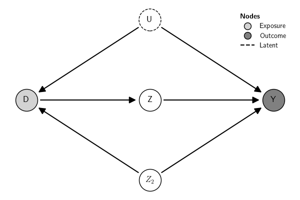

## Usage

The `examples()` class creates pre-defined GCMs. To see the examples
available, use:

``` {.python exports="both" results="output code" tangle="src-gcm-examples.py" cache="yes" noweb="no" session="*Python*" linenums="1" eval="always"}
from causalinf import gcm

gcm.examples()
```

``` python

List of available examples:
--------------------------        
1. Not identifiable
2. One confounder
3. Two confounders
4. Front-door
5. IV with 1 instrument
6. IV with 3 instruments
7. SoO, IV, and do identified with 1 confounder
8. Mediation: 2 sequential 1 confounder
9. Pearl Example 1.1 (a)
10. Pearl Example 1.1 (b)
11. Pearl Example 1.2
12. Pearl Example 1.3 (a)
13. Pearl Example 1.3 (b)
14. Pearl Example 3.1
15. Pearl Example 3.4
16. Pearl Example 3.5

Usage: examples(which='<example name>')
Example: G = examples(which='Pearl Example 3.5')
Note: To print the associated DAG of each example, use examples(print_DAG=True)
```

To get one of the pre-defined examples, use their description. Here is
one example:

``` {.python exports="both" results="output code" tangle="src-gcm-examples.py" cache="yes" noweb="no" session="*Python*" linenums="1" eval="always"}
G = gcm.examples('Front-door')
print(G)
```

``` python
Graph:
Z -> Y
U -> Y
D -> Z
Z2 -> D
Z2 -> Y
U -> D
Observed: Z2, Z
Exposure: D
Outcome: Y
Latent: U
```



Here is another example:

``` {.python exports="both" results="output code" tangle="src-gcm-examples.py" cache="yes" noweb="no" session="*Python*" linenums="1" eval="always"}
G = gcm.examples('Mediation: 2 sequential 1 confounder')
print(G)
```

``` python
Graph:
Z -> Y
D -> M1
D -> Y
M2 -> Y
M1 -> M2
Z -> D
Observed: M2, M1, Z
Exposure: D
Outcome: Y
```


