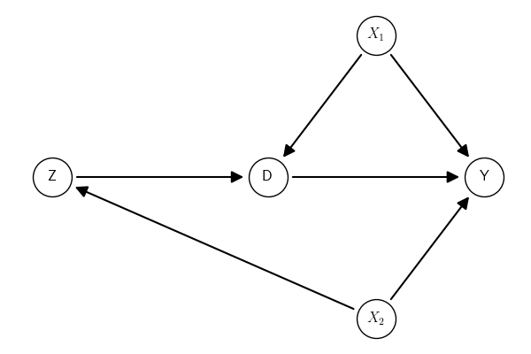

** Prambule :noexport:

#+NAME: save-plot
#+BEGIN_SRC python :exports results :results output raw :tangle src-scm.py :cache no :noweb yes :session *Python* :var fn=""
#
from causalinf import options as opt
opt.set_options(show_plot=False)
# Save figures
fns = ["./tables-and-figures/" + f"{fn}.png",
       "./tables-and-figures/" + f"{fn}.pdf"]
[plt.savefig(fn) for fn in fns]
plt.close('all')

print(# "#+begin_src org \n"# # # 
      # "#+ATTR_ORG: :width 200/250/300/400/500/600\n"
      # "#+ATTR_LATEX: :width 1\textwidth :placement [ht!]\n"
      # "#+CAPTION: Comparing performance for pivot_wide()\n"
      # "#+Name: fig-pivot-wide\n"
      f"[[./tables-and-figures/{fn}.png]]\n"
      # "#+end_src\n"# # # 
)
#+END_SRC

#+RESULTS: save-plot
[[./tables-and-figures/.png]]

** Creating GCM
:PROPERTIES:
:CUSTOM_ID: sec-creating-dags
:END:

Suppose we want to create the following Graphical Causal Model (GCM).

# dag-example-0
#+BEGIN_SRC python :exports results :results output raw :cache yes :noweb no :session *Python* :tangle src-scm.py
from causalinf import scm

G = scm.examples('SoO, IV, and do identified with 1 confounder')
G = G.set_nodes_role({})
G.plot()
#+END_SRC

#+RESULTS[c7612b2b301f2eca37f33f96edd44ea8fef27ddd]:

#+CALL: save-plot(fn="01-creating.gcm") 

#+RESULTS[a059b57d7a9f00c160be5e3b81e9b2e1cbbd63fb]:

The graph object can be created using a string describing the graph and the class ~scm.DAG()~ from the module ~scm~ of ~causalinf~. There are many options to use for the string syntax. Any combination of the syntax options below will work.

# dag-example-0-str
#+BEGIN_SRC python :exports both :results output code :tangle src-scm.py :cache yes :noweb no :session *Python* :linenums 1
from causalinf import scm

# option 1: group the parents of each node
# --------
dag = """
Y <- {X1, X2, D}
D <- {X1, Z}
Z <- X2
"""
# option 2: group the children of each node
# --------
dag = """
Z -> D
X1 -> {D, Y}
X2 -> {Z, Y}
D -> Y
"""
# option 3: one or more arrows per line
# --------
dag = """
Y <- X2 -> Z -> D -> Y
D <- X1 -> Y
"""
# or
dag = """
Y <- X2 -> Z -> D -> Y
X1 -> Y
X1 -> D
"""

G = scm.DAG(dag)
print(G)

#+END_SRC

#+RESULTS[e09b63a30f3d352168e0ed7df8fc375c42172ac6]:
#+begin_src python
Graph:
Z -> D
X2 -> Z
D -> Y
X1 -> Y
X1 -> D
X2 -> Y
Observed: X2, D, Z, Y, X1
#+end_src

If no further information is provided, all variables (nodes) are assumed to be observed.
# 

#+BEGIN_SRC python :exports both :results output code :tangle src-scm.py :cache yes :noweb no :session *Python* :linenums 1
from causalinf import scm 
dag = """
Y <- {X1, X2, D}
D <- {X1, Z}
Z <- X2
"""
G = scm.DAG(dag)
print(G)
#+END_SRC

#+RESULTS[b4a0c46738714dca6b38c6fadee65a79b3ce9b8c]:
#+begin_src python
Graph:
Z -> D
X2 -> Z
D -> Y
X1 -> Y
X1 -> D
X2 -> Y
Observed: X2, D, Z, Y, X1
#+end_src

There are different ways to set the type of variable as /Exposure/, /Outcome/, or /Latent/ using a dictionary.

# 
#+BEGIN_SRC python :exports both :results output code :tangle src-scm.py :cache yes :noweb no :session *Python* :linenums 1
var_types = {
    "Exposure": "D",
    "Outcome": "Y",
    "Latent": "X1"
}
# set when when creating the DAG:
G = scm.DAG(dag, nodes_role=var_types)

# or using the set_nodes_role()
G = G.set_nodes_role(var_types)

print(G)
#+END_SRC

#+RESULTS[6da884e60dc7f5892d009709050df2ac068d46d8]:
#+begin_src python
Graph:
Z -> D
X2 -> Z
D -> Y
X1 -> Y
X1 -> D
X2 -> Y
Observed: X2, Z
Exposure: D
Outcome: Y
Latent: X1
#+end_src

But note that resetting the variable types changes all of them, and omitted information assumes that the variables is of the /Observed/ type. For instance:
# 
#+BEGIN_SRC python :exports both :results output code :tangle src-scm.py :cache yes :noweb no :session *Python* :linenums 1
# or using the set_nodes_role()
G = G.set_nodes_role({"Outcome": "D"})

print(G)
#+END_SRC

#+RESULTS[df69d33f6f5017bce2a5db861fe1856eed42422a]:
#+begin_src python
Graph:
Z -> D
X2 -> Z
D -> Y
X1 -> Y
X1 -> D
X2 -> Y
Observed: X2, Z, Y, X1
Outcome: D
#+end_src

Arbitraty types can be used. These are used only for plotting. For analysis (identification and estimation), only the four basic ones (/Outcome/, /Exposure/, /Latent/, and /Observed/) are used.

# 
#+BEGIN_SRC python :exports both :results output code :tangle src-scm.py :cache yes :noweb no :session *Python* :linenums 1
# or using the set_nodes_role()
G = G.set_nodes_role({"My favorite var": "D"})

print(G)
#+END_SRC

#+RESULTS[383473a1247c7e3c746d5afbf2adc0321d7922c2]:
#+begin_src python
Graph:
Z -> D
X2 -> Z
D -> Y
X1 -> Y
X1 -> D
X2 -> Y
Observed: X2, Z, Y, X1
My favorite var: D
#+end_src

** Bidirected/undirected edges

It is possible to define /undirected/ and /bidirected/  edges as well with ~--~ and ~<->~. /Bidirected edges/ in the context of causal inference with DAGs indicate an omitted common cause between the variables connected by the bidirected arrow. /Undirected edges/, on the other hand, in the context of causal inference with DAGs, are used to represent the skeleton of the DAG or observationally equivalent edges. That is, they are edges whose direction cannot be decided inferentially using observational data unless other parametric assumptions are adopted. 

#+BEGIN_SRC python :exports both :results output code :tangle src-scm.py :cache yes :noweb no :session *Python* :linenums 1
from causalinf import scm 
dag = """
Y <- {X1, X2, D}
D <- {X1, Z}
Z <- X2
Z2 <-> X2
X1 -- Y
"""
G = scm.DAG(dag)
print(G)
#+END_SRC

#+RESULTS[f4049ae5eb16108a35eadd6ff168cf0ecd36e1a2]:
#+begin_src python
Graph:
Z -> D
X2 -> Z
D -> Y
X1 -> Y
X1 -> D
X2 -> Y
Z2 <-> X2
Y -- X1
Observed: Z2, X2, D, Z, Y, X1
#+end_src

** GCM Object

The Graphical Causal Model (SCM) object has many useful properties.

# 
#+BEGIN_SRC python :exports both :results output code :tangle src-creating.py :cache yes :noweb no :session *Python* :linenums 1
from causalinf import scm 
dag = """
Y <- {X1, X2, D}
D <- {X1, Z}
Z <- X2
Z2 <-> X2
X1 -- Y
"""
G = scm.DAG(dag)
print(f"""
Nodes:
{G.nodes}
Nodes info:
{G.nodes_info}
Directed edges:
{G.directed}
Bidirected edges:
{G.bidirected}
Undirected edges:
{G.undirected}
""")
#+END_SRC

#+RESULTS[466de18f6897b96403164fb0308263eba06404d4]:
#+begin_src python

Nodes:
{'Z2', 'X2', 'D', 'Z', 'Y', 'X1'}
Nodes info:
{'Z2': {'role': 'Observed', 'label': 'Z2'}, 'X2': {'role': 'Observed', 'label': 'X2'}, 'D': {'role': 'Observed', 'label': 'D'}, 'Z': {'role': 'Observed', 'label': 'Z'}, 'Y': {'role': 'Observed', 'label': 'Y'}, 'X1': {'role': 'Observed', 'label': 'X1'}}
Directed edges:
[('Z', 'D'), ('X2', 'Z'), ('D', 'Y'), ('X1', 'Y'), ('X1', 'D'), ('X2', 'Y')]
Bidirected edges:
[(('Z2', 'X2'), ('X2', 'Z2'))]
Undirected edges:
[{'Y', 'X1'}]
#+end_src

