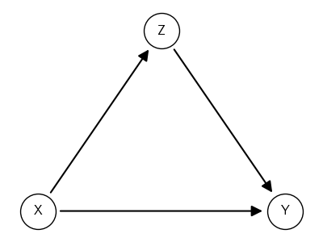
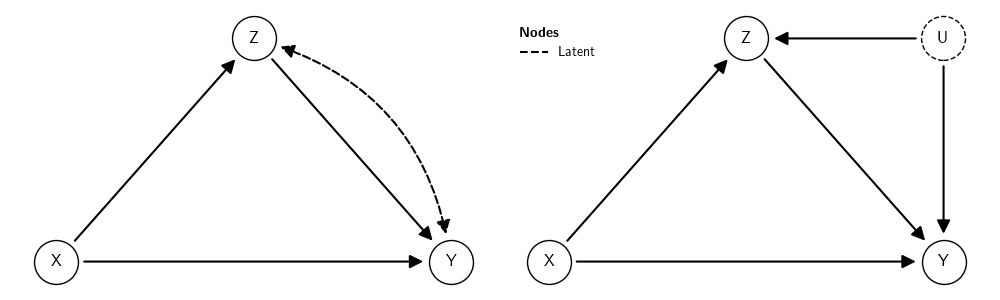

#+NAME: save-plot
#+BEGIN_SRC python :exports results :results silent :tangle src-scm.py :cache no :noweb yes :session *Python* :var fn=""
import matplotlib.pyplot as plt
from causalinf import options as opt
import os
opt.set_options(show_plot=False)
# Save figures
fn = os.path.splitext(fn)[0]
fns = ["./tables-and-figures/" + f"{fn}.png",
       "./tables-and-figures/" + f"{fn}.pdf"]
[plt.savefig(fn) for fn in fns]
plt.close('all')

print(# "#+begin_src org \n"# # # 
      # "#+ATTR_ORG: :width 200/250/300/400/500/600\n"
      # "#+ATTR_LATEX: :width 1\textwidth :placement [ht!]\n"
      # "#+CAPTION: Comparing performance for pivot_wide()\n"
      # "#+Name: fig-pivot-wide\n"
      f"[[./tables-and-figures/{fn}.png]]\n"
      # "#+end_src\n"# # # 
)
#+END_SRC

*Graphical causal models* (GCM's) are *directed acyclic graphs* (DAG's) that model causal relations between variables. The variables are represented by the nodes in the graph; the causal relations between them are represented by the graph's directed edges, that is, arrows and their direction connecting the nodes; and the absence of causal relations is represented by the absence of edges connecting the nodes. More precisely, the absence of an arrow from a node X to a node Y means that the causal effect of X on Y is /certainly/ zero. The presence of an arrow indicates that the causal effect may or may not be zero. *GCM* in causal inference should be viewed as *assumptions* about the causal relations that were or were not operating in reality when the data were collected.

For instance, consider the following graph:

# 
#+BEGIN_SRC python :exports none :results silent :cache yes :noweb no :session *Python* :tangle src-scm.py :linenums 1
from causalinf import scm
dag = """
X -> {Z, Y}
Z -> Y
"""
pos = {"X":(0,0), "Y":(1, 0), "Z":(0.5, 0.5)}
G = scm.DAG(dag, nodes_position=pos)
G.plot(figsize=[4,3])
#+END_SRC

#+CALL: save-plot(fn="00-overview") 

#+RESULTS:

It states that:
1. X causally affects Y and Z (and these effects may be zero).
2. Z causally affects Y (and this effect may be zero) but not X (i.e., this effect is zero for sure).
3. Y does not affect X or Z (i.e., these effects are zero for sure).
4. There is no unobserved common cause between these variables.

On the other hand, consider these graphs:

#+BEGIN_SRC python :exports none :results silent :cache yes :noweb no :session *Python* :tangle src-scm.py :linenums 1
from causalinf import scm
dag1 = """
X -> {Z, Y}
Z -> Y
Z <-> Y
"""
dag2 = """
X -> {Z, Y}
Z -> Y
U -> Y
U -> Z
"""
pos1 = {"X":(0,0), "Y":(1, 0), "Z":(0.5, 0.5)}
pos2 = {"X":(0,0), "Y":(1, 0), "Z":(0.5, 0.5), "U":(1, .5)}
G1 = scm.DAG(dag1, nodes_position=pos1)
G2 = scm.DAG(dag2, nodes_position=pos2, nodes_role={"Latent": 'U'})
fig, ax = plt.subplots(nrows=1, ncols=2, figsize=[10, 3], tight_layout=True)
fig.show()
#
G1.plot(ax=ax[0])
G2.plot(ax=ax[1])
#+END_SRC

#+CALL: save-plot(fn="00-overview-latent") 

#+RESULTS:

This is similar to the above example with one exception. They are stating that:
1. X causally affects Y and Z.
2. Z causally affects Y but not X.
3. Y does not affect X or Z.
4. U is an unobserved or latent factor that affects both Z and Y.

In the default notation of ~causalinf~, both the left and right graphs above are equivalent to each other. The dashed bidirected arc and the dashed node represent the unobserved/latent common cause (U) of Z and Y. 

The assumptions embedded in the graph as a whole are not testable. For any graph, if one or more of its assumptions are incorrect, one of the following things can happen:

1. Nothing, and the assumption is inconsequential for the estimation of the causal effect;
2. The causal effect remains identifiable, but the estimator produced can be biased;
3. The causal effect may change from identifiable to non-identifiable.

Which case occurs depends on the particular situation. But even if the assumptions as a whole are not testable, given a graph and a variation of it, say by removing, adding, or changing the directions of arrows, it is possible to compare which implications would follow by conducting an identification analysis in each instance. 

The ~causalinf~ package provides functions to conduct causal inference analyses for any given graph. It is possible to:
1. *Create* graphical causal models (GCM).
2. *Visualize* them.
3. *Check* the plausibility of the assumptions of causal relations embedded in the graph
4. Conduct *identification analysis* to check if a causal effect is identifiable, given the graph, and determine which identification strategy can be used to estimate the causal effect if it is identifiable.
5. *Estimate* and make inferences about causal effects when it is identifiable.
6. *Report* the results.

As of now, ~causalinf~ does not provide functionalities to search for the graph that best matches the data, which is often called /causal search/.
