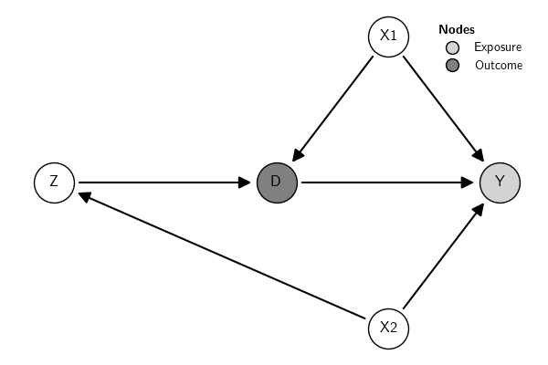
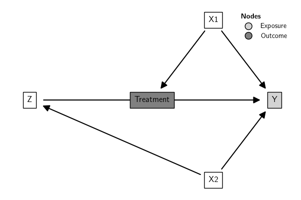
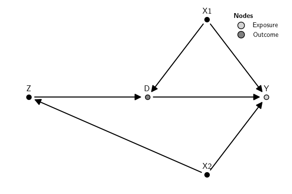
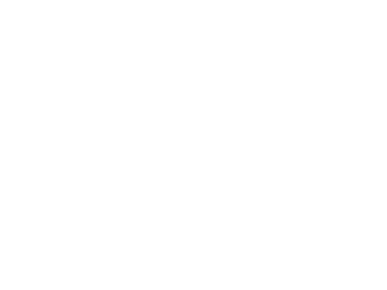

** Prambule :noexport:

#+NAME: save-plot
#+BEGIN_SRC python :exports results :results output raw :tangle src-scm.py :cache no :noweb yes :session *Python* :var fn=""
#
import matplotlib.pyplot as plt
from causalinf import options as opt
opt.set_options(show_plot=False)
# Save figures
fns = ["./tables-and-figures/" + f"{fn}.png",
       "./tables-and-figures/" + f"{fn}.pdf"]
[plt.savefig(fn) for fn in fns]
plt.close('all')

print(# "#+begin_src org \n"# # # 
      # "#+ATTR_ORG: :width 200/250/300/400/500/600\n"
      # "#+ATTR_LATEX: :width 1\textwidth :placement [ht!]\n"
      # "#+CAPTION: Comparing performance for pivot_wide()\n"
      # "#+Name: fig-pivot-wide\n"
      f"[[./tables-and-figures/{fn}.png]]\n"
      # "#+end_src\n"# # # 
)
#+END_SRC

#+RESULTS: save-plot
[[./tables-and-figures/.png]]

** Basic plot

The function [[file:../../../api/#causalinf.scm.DAG.plot][plot()]] plots the graph using ~matplotlib~ and ~networkx~ in the background. The position of the nodes can be set using a dictionary; otherwise, the positions are calculated automatically. If the type of nodes (/Exposure/, /Outcome/, .etc) were set (see [[file:../creating/][Creating DAGs]]), by default the plot includes a legend with the node types. There are many options for customization. Check the documentation of [[file:../../../api/#causalinf.scm.DAG.plot][plot()]] for a comprehensive list of options.

#+BEGIN_SRC python :exports both :results silent :cache yes :noweb no :session *Python* :tangle src-scm.py :linenums 1
from causalinf import gcm
dag = """
Y <- {X1, X2, D}
D <- {X1, Z}
Z <- X2
"""
pos = {'D': (0, 0),
       'Y': (1, 0),
       'Z': (-1, 0),
       'X2': (0.5, -1),
       'X1': (0.5, 1)}
var_types = {"Exposure":"Y", "Outcome":"D"}
G = gcm.DAG(dag, nodes_role=var_types, nodes_position=pos)
G.plot()
#+END_SRC

/Bidirected edges/ are represented by default in the plot with dashed curved lines. In the context of causal inference with DAGs, by convention these arrows (often called "arcs") indicate a latent or unobserved common cause between the variables connected by the bidirected arrow. Alternatively, these variables can be included explicitly when creating the DAG.

/Undirected edges/, on the other hand, in the context of causal inference with DAGs, are used to represent the skeleton of the DAG or observationally equivalent edges. That is, they are edges whose direction cannot be decided inferentially using observational data unless other parametric assumptions are adopted.

Here is an example (the example is just for illustration; the types of edges have no meaning in the example):

#+BEGIN_SRC python :exports both :results silent :tangle src-scm.py :cache yes :noweb no :session *Python* :linenums 1
from causalinf import scm
dag = """
Y <- {X1, X2, D}
D <- X1
Z <- X2
D -- Z
Y <-> X2
"""
pos = {'D': (0, 0),
       'Y': (1, 0),
       'Z': (-1, 0),
       'X2': (0.5, -1),
       'X1': (0.5, 1)}
var_types = {"Exposure":"Y", "Outcome":"D"}
G = scm.DAG(dag, nodes_role=var_types, nodes_position=pos)
G.plot()
#+END_SRC

#+CALL: save-plot(fn="02-plotting-gcm-bidirected-and-undirected") 

#+RESULTS:

** Graph Styles
*** Default
There are some default styles provided by the package. 

#+BEGIN_SRC python :exports both :results silent :tangle src-scm.py :cache yes :noweb no :session *Python* :linenums 1
from causalinf import scm
dag = """
Y <- {X1, X2, D}
D <- {X1, Z}
Z <- X2
"""
pos = {'D': (0, 0),
       'Y': (1, 0),
       'Z': (-1, 0),
       'X2': (0.5, -1),
       'X1': (0.5, 1)}
var_types = {"Exposure":"Y", "Outcome":"D"}
G = scm.DAG(dag, nodes_role=var_types, nodes_position=pos)
G.plot() # this is the default style, equivalent to G.plot(graph_style="default")
#+END_SRC

#+CALL: save-plot(fn="02-plotting-style-default")  :results output raw :exports results

#+RESULTS[60747f5a2aa2bfa14d783929c8efe2ad5d638b27]:

*** Rectangular

Retangular style gives more space for labels. But see also [[#sec-node-style][Node style]].

#+BEGIN_SRC python :exports both :results silent :tangle src-scm.py :cache yes :noweb no :session *Python* :linenums 1
G.plot(graph_style="rectangle", nodes_label={'D':'Treatment'}) 
#+END_SRC

#+CALL: save-plot(fn="02-plotting-style-rectangle")

#+RESULTS[e52875a94d5b0cf538b2c5e65f7ae3626e3ec62e]:

*** Pearl

The "pearl" style uses the design adopted in [[#sec-plot-styles-refs][Pearl (2009)]]. The position of the node label needs to be adjusted manually. The label positions can be adjusted in block using a float or individually using a dictionary. For instance, ~node_label_adj_y={"Z":.1}~ adjusts only the ~y~ position of node \(Z\), while ~node_label_adj_y=.1~ adjusts it for all nodes.

#+BEGIN_SRC python :exports both :results silent :tangle src-scm.py :cache yes :noweb no :session *Python* :linenums 1
G.plot(graph_style="pearl", node_label_adj_y=.1) 
#+END_SRC

#+CALL: save-plot(fn="02-plotting-style-pearl")

#+RESULTS[bc2e04a1eba7aa07614ff8808743f28150a747cf]:

** TODO Plot sub-DAG 
** TODO Nodes
*** Node label 

It is possible to use labels for the nodes. Labels accept LaTeX mathematical expressions. For instance, to use subscripts for some variables, we can set the labels as follows:

#+BEGIN_SRC python :exports code :results silent :tangle src-scm.py :cache yes :noweb no :session *Python* :eval no-export :linenums 1
from causalinf import scm
dag = """
Y <- {X1, X2, D}
D <- {X1, Z}
Z <- X2
"""
pos = {'D': (0, 0),
       'Y': (1, 0),
       'Z': (-1, 0),
       'X2': (0.5, -1),
       'X1': (0.5, 1)}
labels = {
    "X2" : "$X_2$",
    "X1" : "$X_1$"
}
var_types = {"Exposure":"Y", "Outcome":"D"}

G = scm.DAG(dag, nodes_role=var_types, nodes_label=labels, nodes_position=pos)
G.plot()
#+END_SRC

#+CALL: save-plot(fn="02-plotting-gcm-nodes-label") 

#+RESULTS[748e6a0d104ebc6605eacb60c32cb9f567b68315]:

*** TODO Node style 
:PROPERTIES:
:CUSTOM_ID: sec-node-style
:END:
** TODO Edges
*** Edge style
** References
:PROPERTIES:
:CUSTOM_ID: sec-refs
:END:

- Pearl, J. (2009). Causality: Models, Reasoning and Inference. : Cambridge University Press.
