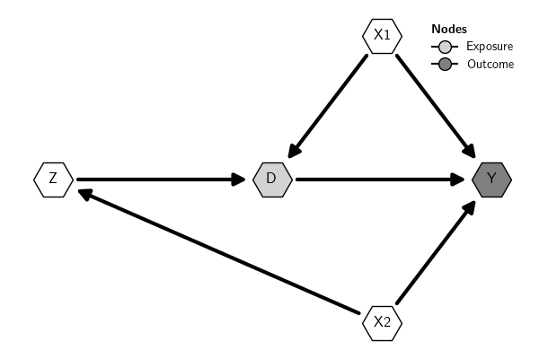
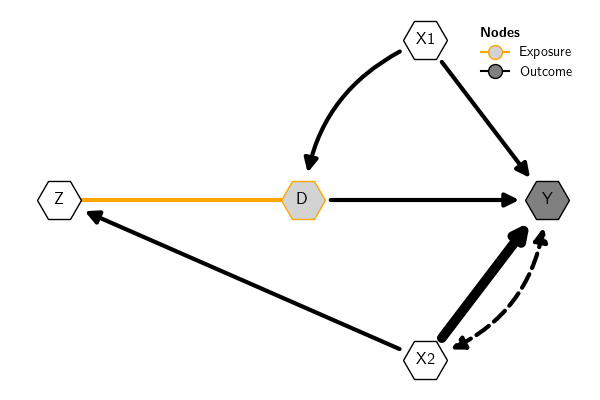
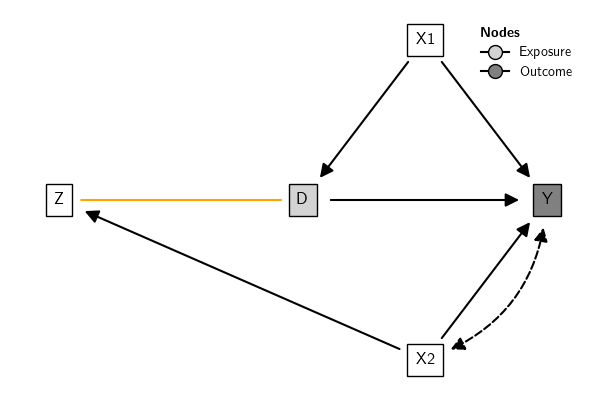
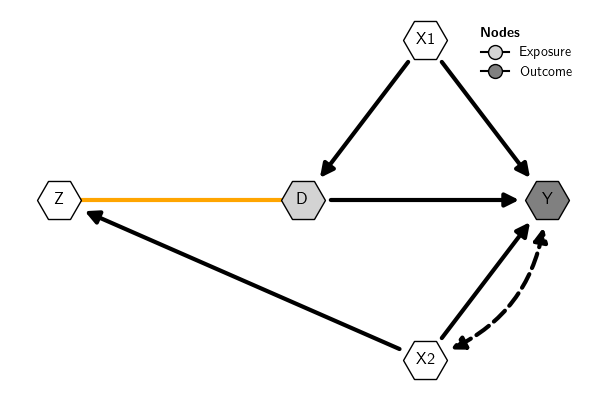
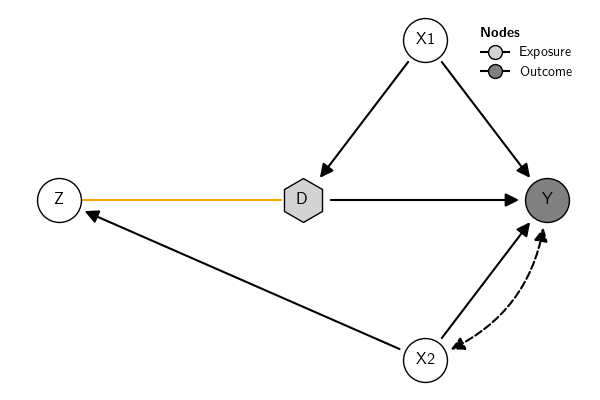
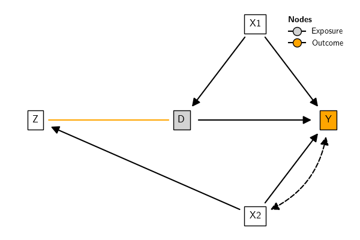
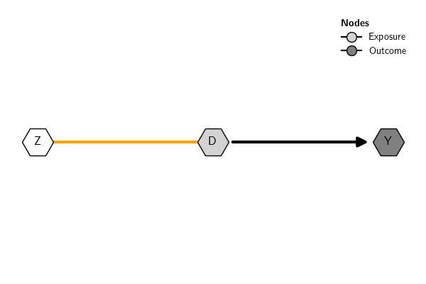

## Overview

The function [plot()](../../..//reference/gcm/DAG/) plots the graph
using `matplotlib` and `networkx` in the background. The position of the
nodes can be set using a dictionary; otherwise, the positions are
calculated automatically. If the type of nodes (*Exposure*, *Outcome*,
.etc) are set (see [Creating DAGs](../build/)), by default the plot
includes a legend with the node types.

There are many options to customize the visual elements of the plot.
They can be customized individually (see [Graph
attributes](#sec-graph-attributes)) or by using styles (see [Graph
styles](#sec-graph-styles)). Check also the
[plot()](../../..//reference/gcm/DAG/) documentation for a comprehensive
list of options.

Here is a basic example:

``` {.python exports="both" results="silent" cache="yes" noweb="no" session="*Python*" tangle="src-scm.py" linenums="1"}
from causalinf import gcm
dag = """
Y <- {X1, X2, D}
D <- {X1, Z}
Z <- X2
"""
pos = {'D': (0, 0),
       'Y': (1, 0),
       'Z': (-1, 0),
       'X2': (0.5, -1),
       'X1': (0.5, 1)}
var_types = {"Exposure":"D", "Outcome":"Y"}
G = gcm.DAG(dag, nodes_role=var_types, nodes_position=pos)
G.plot()
```



*Bidirected edges* are represented by default in the plot with dashed
curved lines. In the context of causal inference with DAGs, by
convention these arrows (often called \"arcs\") indicate a latent or
unobserved common cause between the variables connected by the
bidirected arrow. Alternatively, these variables can be included
explicitly when creating the DAG.

*Undirected edges*, on the other hand, in the context of causal
inference with DAGs, are used to represent the skeleton of the DAG or
observationally equivalent edges. That is, they are edges whose
direction cannot be decided inferentially using observational data
unless other parametric assumptions are adopted.

Here is an example (the example is just for illustration; the types of
edges have no meaning in the example):

``` {.python exports="both" results="silent" tangle="src-scm.py" cache="yes" noweb="no" session="*Python*" linenums="1"}
from causalinf import gcm
dag = """
Y <- {X1, X2, D}
D <- X1
Z <- X2
D -- Z
Y <-> X2
"""
pos = {'D': (0, 0),
       'Y': (1, 0),
       'Z': (-1, 0),
       'X2': (0.5, -1),
       'X1': (0.5, 1)}
var_types = {"Exposure":"D", "Outcome":"Y"}
G = gcm.DAG(dag, nodes_role=var_types, nodes_position=pos)
G.plot()
```


## Graph Attributes {#sec-graph-attributes}

### Style for nodes and edges {#sec-node-style}

Nodes and edges can be styled individually, by type, or altogether. See
[plot()](../../..//reference/gcm/DAG/) for more options and examples.
Here is an example:

``` {.python exports="both" results="silent" tangle="src-gcm-DAG.py" cache="yes" noweb="no" session="*Python*" linenums="1" eval="always"}
G.plot(node_border_color={'Exposure':"orange"}, edge_linewidth={'Directed':3, ('X2', "Y"):7},
       edge_arc={("X1", "D"):.3})
```



### Labels for nodes and edges

It is possible to use labels for nodes and edges. Labels accept LaTeX
mathematical expressions. For instance, to use subscripts for some
variables, we can set the labels as follows:

``` {.python exports="code" results="silent" tangle="src-scm.py" cache="yes" noweb="no" session="*Python*" eval="no-export" linenums="1"}
from causalinf import gcm
dag = """
Y <- {X1, X2, D}
D <- {X1, Z}
Z <- X2
"""
pos = {'D': (0, 0),
       'Y': (1, 0),
       'Z': (-1, 0),
       'X2': (0.5, -1),
       'X1': (0.5, 1)}
labels = {
    "X2" : "$X_2$",
    "X1" : "$X_1$",
    "D" : "$\\widetilde{D}_i$"
}
var_types = {"Exposure":"D", "Outcome":"Y"}

G = gcm.DAG(dag, nodes_role=var_types, nodes_label=labels, nodes_position=pos)
G.plot(edge_label={("Z", "D"):"Z effect on $\\widetilde{D}_i$"})
```


## Graph Styles {#sec-graph-styles}

### Overview

It is possible to change the visual attributes of nodes and edges
individually (see [Graph attributes](#sec-graph-attributes)) or using
**graph styles**. The styles are dictionaries that define the attributes
of the graph objects displayed in the plot.

The `causalinf` module provides built-in DAG styles, which can be extend
to create custom styles. There are two ways to use graph styles:

1.  Set a style *locally* for a specific plot using the argument
    `graph_style` of the function `plot()`
2.  Set a style *globally* using the argument `graph_style` of the
    function `set_options()`

See examples in [Built-in styles](#sec-built-in-styles) and [Custom
styles](#sec-custom-styles).

### Built-in Styles {#sec-built-in-styles}

The function `get_styles()` shows the built-in styles available. If the
argument `which` is provided with the name of a built-in style, the
function returns a dictionary with the attributes of the corresponding
style. If `which='current'`, it returns the current global style.

``` {.python exports="both" results="output code" tangle="src-visualize.py" cache="yes" noweb="no" session="*Python*" linenums="1" eval="always"}
from causalinf import gcm

gcm.get_styles()
```

``` python
To see the style dictionary, use the 'which' argument with the name of a built-in style.
Built-in styles available: 
- default 
- rectangle 
- pearl
Use which='current' to get the current global style.
```

Here is the `default` style dictionary:

``` {.python exports="code" results="silent" tangle="src-plot.py" cache="yes" noweb="no" session="*Python*" linenums="1" eval="always"}
gcm.get_styles(which='default')
```

``` python
{'edges': {'edge_arc': {'bidirected': -0.33, 'directed': 0, 'undirected': 0},
           'edge_color': {'bidirected': 'black',
                          'directed': 'black',
                          'undirected': 'orange'},
           'edge_head_size': {'bidirected': 20,
                              'directed': 20,
                              'undirected': 0},
           'edge_head_style': {'bidirected': '<|-|>',
                               'directed': None,
                               'undirected': '-'},
           'edge_label_alpha': {'bidirected': 1,
                                'directed': 1,
                                'undirected': 1},
           'edge_label_color': {'bidirected': 'black',
                                'directed': 'black',
                                'undirected': 'black'},
           'edge_label_color_background': {'bidirected': None,
                                           'directed': None,
                                           'undirected': None},
           'edge_label_color_border': {'bidirected': None,
                                       'directed': None,
                                       'undirected': None},
           'edge_label_position': {'bidirected': 0.5,
                                   'directed': 0.5,
                                   'undirected': 0.5},
           'edge_label_rotate': {'bidirected': True,
                                 'directed': True,
                                 'undirected': True},
           'edge_label_size': {'bidirected': 13,
                               'directed': 13,
                               'undirected': 13},
           'edge_linewidth': {'bidirected': 1.5,
                              'directed': 1.5,
                              'undirected': 1.5},
           'edge_margin_head': {'bidirected': 20,
                                'directed': 20,
                                'undirected': 0},
           'edge_margin_tail': {'bidirected': 20,
                                'directed': 20,
                                'undirected': 0},
           'edge_style': {'bidirected': 'dashed',
                          'directed': 'solid',
                          'undirected': 'solid'}},
 'nodes': {'Exposure': {'node_border_color': 'black',
                        'node_border_style': '-',
                        'node_border_width': 1,
                        'node_color': 'lightgray',
                        'node_label_box': False,
                        'node_label_box_margin': 0.5,
                        'node_label_box_style': 'square',
                        'node_label_color': 'black',
                        'node_label_fontsize': 12,
                        'node_label_fontweight': 'normal',
                        'node_shape': 'o',
                        'node_size': 1000},
           'Latent': {'node_border_color': 'black',
                      'node_border_style': '--',
                      'node_border_width': 1,
                      'node_color': 'white',
                      'node_label_box': False,
                      'node_label_box_margin': 0.5,
                      'node_label_box_style': 'square',
                      'node_label_color': 'black',
                      'node_label_fontsize': 12,
                      'node_label_fontweight': 'normal',
                      'node_shape': 'o',
                      'node_size': 1000},
           'Observed': {'node_border_color': 'black',
                        'node_border_style': '-',
                        'node_border_width': 1,
                        'node_color': 'white',
                        'node_label_box': False,
                        'node_label_box_margin': 0.5,
                        'node_label_box_style': 'square',
                        'node_label_color': 'black',
                        'node_label_fontsize': 12,
                        'node_label_fontweight': 'normal',
                        'node_shape': 'o',
                        'node_size': 1000},
           'Outcome': {'node_border_color': 'black',
                       'node_border_style': '-',
                       'node_border_width': 1,
                       'node_color': 'gray',
                       'node_label_box': False,
                       'node_label_box_margin': 0.5,
                       'node_label_box_style': 'square',
                       'node_label_color': 'black',
                       'node_label_fontsize': 12,
                       'node_label_fontweight': 'normal',
                       'node_shape': 'o',
                       'node_size': 1000}}}
```

Here is an example:

``` {.python exports="code" results="silent" tangle="src-visualize.py" cache="yes" noweb="no" session="*Python*" linenums="1" eval="always"}
from causalinf import gcm
dag = """
Y <- {X1, X2, D}
D <- X1
Z <- X2
D -- Z
Y <-> X2
"""
pos = {'D': (0, 0),
       'Y': (1, 0),
       'Z': (-1, 0),
       'X2': (0.5, -1),
       'X1': (0.5, 1)}
var_types = {"Exposure":"D", "Outcome":"Y"}
G = gcm.DAG(dag, nodes_role=var_types, nodes_position=pos)
```

By default, plots use a built-in style called \'default\'. Here is how
the default style look like:

``` {.python exports="both" results="silent" tangle="src-scm.py" cache="yes" noweb="no" session="*Python*" linenums="1"}
G.plot(graph_style='default')
```


Retangular style gives more space for labels (see also [Node
style](#sec-node-style)):

``` {.python exports="both" results="silent" tangle="src-scm.py" cache="yes" noweb="no" session="*Python*" linenums="1"}
G.plot(graph_style="rectangle", nodes_label={'D':'Treatment'}) 
```


The \"pearl\" style uses the design adopted in [Pearl
(2009)](#sec-plot-styles-refs). The position of the node label needs to
be adjusted manually. The label positions can be adjusted in block using
a float or individually using a dictionary. For instance,
`node_label_adj_y={"Z":.1}` adjusts only the `y` position of node Z,
while `node_label_adj_y=.1` adjusts it for all nodes.

``` {.python exports="both" results="silent" tangle="src-scm.py" cache="yes" noweb="no" session="*Python*" linenums="1"}
G.plot(graph_style="pearl", node_label_adj_y=.1) 
```


Styles can be set *locally* using the argument `graph_style` of the
function `plot()` or *globally* using the argument `graph_style` of the
function `set_options()`. Local options always overwrite the global
options for the current plot.

Here are examples illustrating how to use the built-in styles. This will
use whatever style is currently set as the global option:

``` {.python exports="both" results="silent" tangle="src-visualize.py" cache="yes" noweb="no" session="*Python*" linenums="1" eval="always"}
G.plot()
```


This will set the \'rectangle\' built-in style *globally*, that is, for
all plots unless the option is changed again:

``` {.python exports="both" results="silent" tangle="src-visualize.py" cache="yes" noweb="no" session="*Python*" linenums="1" eval="always"}
from causalinf.options import set_options

# set style globally
set_options(graph_style='rectangle')

# use the current global style
G.plot()
```



This will use the \'default\' built-in style *locally*; that is, only
for the current plot (this option always overwrites the global style for
the current plot):

``` {.python exports="both" results="silent" tangle="src-visualize.py" cache="yes" noweb="no" session="*Python*" linenums="1" eval="always"}
G.plot(graph_style='default')
```


In sum:

``` {.python exports="code" results="silent" tangle="src-visualize.py" cache="yes" noweb="no" session="*Python*" linenums="1" eval="never"}

 #this sets the global stype to the built-in style 'rectangle'; gcm.get_styles() shows other built-in style options
set_options(graph_style='rectangle')

# this uses the global style, whatever that is
G.plot()

# this uses the 'default' style in the current plot, regardless of what the global style is
G.plot(graph_style='default')

# this uses the 'rectangle' style in the current plot, regardless of what the global style is
G.plot(graph_style='rectangle')

# this uses the pearl style in the current plot, regardless of what the global style is
G.plot(graph_style='pearl')


```

### Custom Style {#sec-custom-styles}

It is possible to extend the existing built-in styles (see [Built-in
Styles](#sec-built-in-styles)) to create custom styles. This is done
using the function `make_style()`. The argument `baseline` of that
function informs which built-in style will be extended. By default, it
extends the `'default'` style. The first argument `new_style` of that
function must be a dictionary with keys containing the names of the
visual properties of the graph to be set in the custom style. The
acceptable keys are those that match the names in the dictionary with
the built-in styles. See more details in the documentation
[here](../../../reference/gcm/make_style).

Here is an example to extend the `default` built-in style. The `default`
style dictionary is (all built-in styles use the same keys):

``` {.python exports="code" results="silent" tangle="src-visualize.py" cache="yes" noweb="no" session="*Python*" linenums="1" eval="always"}
from causalinf import gcm

gcm.get_styles('default')
```

``` python
{'edges': {'edge_arc': {'bidirected': -0.33, 'directed': 0, 'undirected': 0},
           'edge_color': {'bidirected': 'black',
                          'directed': 'black',
                          'undirected': 'orange'},
           'edge_head_size': {'bidirected': 20,
                              'directed': 20,
                              'undirected': 0},
           'edge_head_style': {'bidirected': '<|-|>',
                               'directed': None,
                               'undirected': '-'},
           'edge_label_alpha': {'bidirected': 1,
                                'directed': 1,
                                'undirected': 1},
           'edge_label_color': {'bidirected': 'black',
                                'directed': 'black',
                                'undirected': 'black'},
           'edge_label_color_background': {'bidirected': None,
                                           'directed': None,
                                           'undirected': None},
           'edge_label_color_border': {'bidirected': None,
                                       'directed': None,
                                       'undirected': None},
           'edge_label_position': {'bidirected': 0.5,
                                   'directed': 0.5,
                                   'undirected': 0.5},
           'edge_label_rotate': {'bidirected': True,
                                 'directed': True,
                                 'undirected': True},
           'edge_label_size': {'bidirected': 13,
                               'directed': 13,
                               'undirected': 13},
           'edge_linewidth': {'bidirected': 1.5,
                              'directed': 1.5,
                              'undirected': 1.5},
           'edge_margin_head': {'bidirected': 20,
                                'directed': 20,
                                'undirected': 0},
           'edge_margin_tail': {'bidirected': 20,
                                'directed': 20,
                                'undirected': 0},
           'edge_style': {'bidirected': 'dashed',
                          'directed': 'solid',
                          'undirected': 'solid'}},
 'nodes': {'Exposure': {'node_border_color': 'black',
                        'node_border_style': '-',
                        'node_border_width': 1,
                        'node_color': 'lightgray',
                        'node_label_box': False,
                        'node_label_box_margin': 0.5,
                        'node_label_box_style': 'square',
                        'node_label_color': 'black',
                        'node_label_fontsize': 12,
                        'node_label_fontweight': 'normal',
                        'node_shape': 'o',
                        'node_size': 1000},
           'Latent': {'node_border_color': 'black',
                      'node_border_style': '--',
                      'node_border_width': 1,
                      'node_color': 'white',
                      'node_label_box': False,
                      'node_label_box_margin': 0.5,
                      'node_label_box_style': 'square',
                      'node_label_color': 'black',
                      'node_label_fontsize': 12,
                      'node_label_fontweight': 'normal',
                      'node_shape': 'o',
                      'node_size': 1000},
           'Observed': {'node_border_color': 'black',
                        'node_border_style': '-',
                        'node_border_width': 1,
                        'node_color': 'white',
                        'node_label_box': False,
                        'node_label_box_margin': 0.5,
                        'node_label_box_style': 'square',
                        'node_label_color': 'black',
                        'node_label_fontsize': 12,
                        'node_label_fontweight': 'normal',
                        'node_shape': 'o',
                        'node_size': 1000},
           'Outcome': {'node_border_color': 'black',
                       'node_border_style': '-',
                       'node_border_width': 1,
                       'node_color': 'gray',
                       'node_label_box': False,
                       'node_label_box_margin': 0.5,
                       'node_label_box_style': 'square',
                       'node_label_color': 'black',
                       'node_label_fontsize': 12,
                       'node_label_fontweight': 'normal',
                       'node_shape': 'o',
                       'node_size': 1000}}}
```

Here are three new custom styles, two based on the `'default'` built-in
style and one based on the `'rectangle'` built-in style:

``` {.python exports="code" results="silent" tangle="src-visualize.py" cache="yes" noweb="no" session="*Python*" linenums="1" eval="always"}
from causalinf import gcm 

# default style but with the shapes of all nodes to 'H' (from matplotlib markers) and all edge widths to 3
style1 = gcm.make_style({"node_shape": 'H', 'edge_linewidth':3})

# default style but with the shapes of all Exposure nodes to 'h' (from matplotlib markers)
style2 = gcm.make_style({"Exposure": {"node_shape": 'h'}, })

# rectangle style but with the color of all Outcome nodes to 'orange'
style3 = gcm.make_style({'Outcome': {'node_color':'orange'}}, baseline='rectangle')


```

To create the graph to use the styles:

``` {.python exports="code" results="silent" tangle="src-visualize.py" cache="yes" noweb="no" session="*Python*" linenums="1" eval="always"}
from causalinf import gcm
dag = """
Y <- {X1, X2, D}
D <- X1
Z <- X2
D -- Z
Y <-> X2
"""
pos = {'D': (0, 0),
       'Y': (1, 0),
       'Z': (-1, 0),
       'X2': (0.5, -1),
       'X1': (0.5, 1)}
var_types = {"Exposure":"D", "Outcome":"Y"}
G = gcm.DAG(dag, nodes_role=var_types, nodes_position=pos)
```

The new styles can be used either *locally* or *globally*. This sets the
`style1` *globally*:

``` {.python exports="both" results="silent" tangle="src-visualize.py" cache="yes" noweb="no" session="*Python*" linenums="1" eval="always"}
from causalinf.options import set_options

# this sets style1 globally
set_options(graph_style=style1)

# plot using the current glboal style
G.plot()
```



This uses the `style2` *locally*:

``` {.python exports="both" results="silent" tangle="src-visualize.py" cache="yes" noweb="no" session="*Python*" linenums="1" eval="always"}
# plot using the current glboal style
G.plot(graph_style=style2)
```



The same for style3:

``` {.python exports="both" results="silent" tangle="src-visualize.py" cache="yes" noweb="no" session="*Python*" linenums="1" eval="always"}
# plot using the current glboal style
G.plot(graph_style=style3)
```



## Plot sub-DAG

It is possible to plot a sub-DAG by selecting the subset of nodes or
edges to plot.

``` {.python exports="both" results="silent" tangle="src-plot.py" cache="yes" noweb="no" session="*Python*" linenums="1" eval="always"}
from causalinf import gcm
dag = """
Y <- {X1, X2, D}
D <- X1
Z <- X2
D -- Z
Y <-> X2
"""
pos = {'D': (0, 0),
       'Y': (1, 0),
       'Z': (-1, 0),
       'X2': (0.5, -1),
       'X1': (0.5, 1)}
var_types = {"Exposure":"D", "Outcome":"Y"}
G = gcm.DAG(dag, nodes_role=var_types, nodes_position=pos)

# plot the full graph
G.plot()
```


Plot only nodes Z, D, and Y:

``` {.python exports="both" results="silent" tangle="src-plot.py" cache="yes" noweb="no" session="*Python*" linenums="1" eval="always"}
G.plot(node_subset=["Z", "D", "Y"])
```



## References {#sec-refs}

-   Pearl, J. (2009). Causality: Models, Reasoning and Inference. :
    Cambridge University Press.
