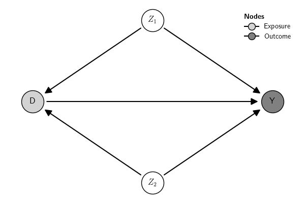

## Overview

The function `<submodule>.estimate(<args>)` can be used in all
submodules to run the estimation and collect inference statistics
(p-value, z-scores, etc.). For instance, to estimate a **DiD** model,
use:

``` {.python exports="code" results="silent" tangle="src-overview.py" cache="yes" noweb="no" session="*Python*" linenums="1" eval="never"}
from causalinf import did

mod = did.estimate(<args>, data=<DataFrame>)
```

`<args>` vary across submodules depending on the method used. See
[Methods](../../methods/overview).

The content of the object created by `estimate()` is method-specific,
but it contains the same key properties across methods. These properties
provide information about the estimation procedure, including the `fit`
statistics, the `statistical model` (e.g., logit, linear model,
non-parametric difference in averages, etc.) used to compute the
parameter(s), the estimated `parameters`, `standard errors`, and
additional `options` used by the statistical model. The way the
information is stored in the properties of the `estimate()` object is
standardized across causal models.

## Example

Let us use a Graphical Causal Model (GCM) combined with a Structural
Causal Model (SCM) to illustrate the `estimate()` object. The example
below uses a built-in GCM example with simulated data (see
[Examples](../examples) and [Simulate Data](../simulate-data) for
details). The example below estimates the SCM using a Linear Structural
Equation Model (LSEM) created from the SCM (see
[SCM](../../methods/scm/introduction/) for more details).

``` {.python exports="code" results="silent" tangle="src-estimation.py" cache="yes" noweb="no" session="*Python*" linenums="1" eval="always"}
from causalinf import simulate
from causalinf import gcm
from causalinf import scm

# get the example
G = gcm.examples('Two confounders')
# simulate the data from LSEM
sim = simulate.lsem(G, seed=1)

G.plot()
```



Here is the data:

``` {.python exports="both" results="output code" tangle="src-estimation.py" cache="yes" noweb="no" session="*Python*" linenums="1" eval="always"}

df = sim.data
print(df)

```

``` python
shape: (1_000, 4)
┌───────────────────────────────┐
│    Z1      Z2       D       Y │
│   f64     f64     f64     f64 │
╞═══════════════════════════════╡
│  1.62   -0.15    2.03   -1.47 │
│ -0.61   -2.43   -0.03    0.43 │
│ -0.53    0.51    0.97    0.95 │
│     …       …       …       … │
│ -0.07   -0.92    1.25    1.65 │
│  0.35    0.65   -0.13    0.19 │
│ -0.19    1.39    0.76   -1.12 │
└───────────────────────────────┘
```

To estimate the model use:

``` {.python exports="both" results="output code" tangle="src-estimation.py" cache="yes" noweb="no" session="*Python*" linenums="1" eval="always"}
mod = scm.estimate(G, data=df)
```

``` python
Estimating LSEM...done!
```

It produces an estimate object:

``` {.python exports="both" results="output code" tangle="src-estimation.py" cache="yes" noweb="no" session="*Python*" linenums="1" eval="always"}
print(mod.__class__)
```

``` python
<class 'causalinf.scm.estimate'>
```

The main pieces of information that can be directly extracted from the
`estimate()` object are:

``` {.python exports="both" results="output code" tangle="src-estimation.py" cache="yes" noweb="no" session="*Python*" linenums="1" eval="always"}
mod.est.parameters.print() # mod.est.parameters is a dataframe from tidypolars4sci

print(mod.est.se)

print(mod.est.fit)

print(mod.est.fit_extra)

print(mod.est.options)
```

``` python
shape: (16, 9)
┌────────────────────────────────────────────────────────────────────────────────────────────────────────────┐
│ term                            label           estimate   sig     se      lo      hi   statistic   pvalue │
│ str                             str                  f64   str    f64     f64     f64         f64      f64 │
╞════════════════════════════════════════════════════════════════════════════════════════════════════════════╡
│ Y ~ 1                           beta_0Y            -0.27   ***   0.03   -0.34   -0.20       -7.84     0.00 │
│ Y ~ D                           beta_D.Y           -0.36   ***   0.03   -0.43   -0.30      -11.32     0.00 │
│ Y ~ Z2                          beta_Z2.Y          -0.22   ***   0.04   -0.29   -0.14       -5.78     0.00 │
│ Y ~ Z1                          beta_Z1.Y          -0.89   ***   0.04   -0.97   -0.81      -22.40     0.00 │
│ D ~ 1                           beta_0D             0.42   ***   0.03    0.35    0.48       13.27     0.00 │
│ D ~ Z2                          beta_Z2.D          -0.68   ***   0.03   -0.74   -0.62      -22.50     0.00 │
│ D ~ Z1                          beta_Z1.D           0.73   ***   0.03    0.66    0.79       22.75     0.00 │
│ Y ~~ Y                                              1.00   ***   0.04    0.91    1.09       22.36     0.00 │
│ D ~~ D                                              0.98   ***   0.04    0.89    1.06       22.36     0.00 │
│ Z2 ~~ Z2                                            1.06         0.00    1.06    1.06        null     null │
│ Z2 ~~ Z1                                            0.02         0.00    0.02    0.02        null     null │
│ Z1 ~~ Z1                                            0.96         0.00    0.96    0.96        null     null │
│ Z2 ~ 1                                              0.03         0.00    0.03    0.03        null     null │
│ Z1 ~ 1                                              0.04         0.00    0.04    0.04        null     null │
│ Direct_effect := (beta_D.Y)     Direct_effect      -0.36   ***   0.03   -0.43   -0.30      -11.32     0.00 │
│ Total_effect := Direct_effect   Total_effect       -0.36   ***   0.03   -0.43   -0.30      -11.32     0.00 │
└────────────────────────────────────────────────────────────────────────────────────────────────────────────┘
{'type': 'classic', 'description': 'Standard errors: classic'}
{'Model': '(footnote)', 'Outcome_type': '(footnote)', 'Estimator': 'ML', 'Std_Error': 'classic', 'N_obs': 1000, 'RMSE': 0.0, 'AIC': 5670.735569404551, 'BIC': 5714.90536691539, 'R2': None, 'R2_adj': None, 'DF_resid': None, 'DF_model': 0}
{'npar': 9.0, 'fmin': 0.0, 'chisq': 0.0, 'df': 0.0, 'pvalue': nan, 'baseline.chisq': 1572.0227488782, 'baseline.df': 5.0, 'baseline.pvalue': 0.0, 'cfi': 1.0, 'tli': 1.0, 'nnfi': 1.0, 'rfi': 1.0, 'nfi': 1.0, 'pnfi': 0.0, 'ifi': 1.0, 'rni': 1.0, 'logl': -2826.3677847022755, 'unrestricted.logl': -2826.3677847022755, 'aic': 5670.735569404551, 'bic': 5714.90536691539, 'ntotal': 1000.0, 'bic2': 5686.320864466223, 'rmsea': 0.0, 'rmsea.ci.lower': 0.0, 'rmsea.ci.upper': 0.0, 'rmsea.ci.level': 0.9, 'rmsea.pvalue': nan, 'rmsea.close.h0': 0.05, 'rmsea.notclose.pvalue': nan, 'rmsea.notclose.h0': 0.08, 'rmr': 3.220437661179089e-17, 'rmr_nomean': 3.8104732280068437e-17, 'srmr': 1.6799586839162653e-17, 'srmr_bentler': 1.6799586839162653e-17, 'srmr_bentler_nomean': 1.987753921271931e-17, 'crmr': 1.987753921271931e-17, 'crmr_nomean': 2.5661792778148927e-17, 'srmr_mplus': 3.067134389273865e-17, 'srmr_mplus_nomean': 3.62908235048654e-17, 'cn_05': nan, 'cn_01': nan, 'gfi': 1.0, 'agfi': 1.0, 'pgfi': 0.0, 'mfi': 1.0, 'ecvi': 0.018}
{'model.type': 'sem', 'mimic': 'lavaan', 'meanstructure': True, 'int.ov.free': True, 'int.lv.free': False, 'marker.int.zero': False, 'conditional.x': False, 'fixed.x': True, 'orthogonal': False, 'orthogonal.x': False, 'orthogonal.y': False, 'std.lv': False, 'correlation': False, 'effect.coding': '', 'ceq.simple': False, 'parameterization': 'delta', 'auto.fix.first': True, 'auto.fix.single': True, 'auto.var': True, 'auto.cov.lv.x': True, 'auto.cov.y': True, 'auto.th': True, 'auto.delta': True, 'auto.efa': True, 'rotation': 'geomin', 'rotation.se': 'bordered', 'rotation.args': {'orthogonal': False, 'row.weights': 'none', 'std.ov': True, 'geomin.epsilon': 0.001, 'orthomax.gamma': 1.0, 'cf.gamma': 0.0, 'oblimin.gamma': 0.0, 'promax.kappa': 4.0, 'target': [], 'target.mask': [], 'rstarts': 30, 'algorithm': 'gpa', 'reflect': True, 'order.lv.by': 'index', 'gpa.tol': 1e-05, 'tol': 1e-08, 'warn': False, 'verbose': False, 'jac.init.rot': True, 'max.iter': 10000}, 'std.ov': False, 'missing': 'listwise', 'sampling.weights.normalization': 'total', 'samplestats': True, 'sample.cov.rescale': True, 'sample.cov.robust': False, 'sample.icov': True, 'ridge': False, 'ridge.constant': 'default', 'group.label': None, 'group.equal': [], 'group.partial': [], 'group.w.free': False, 'level.label': None, 'estimator': 'ML', 'estimator.orig': 'ML', 'estimator.args': [], 'likelihood': 'normal', 'link': 'default', 'representation': 'LISREL', 'do.fit': True, 'bounds': 'none', 'rstarts': 0, 'se': 'standard', 'test': 'standard', 'information': ['expected', 'expected'], 'h1.information': ['structured', 'structured'], 'observed.information': ['hessian', 'hessian'], 'information.meat': 'first.order', 'h1.information.meat': 'structured', 'omega.information': 'expected', 'omega.h1.information': 'unstructured', 'omega.information.meat': 'first.order', 'omega.h1.information.meat': 'unstructured', 'scaled.test': 'standard', 'ug2.old.approach': False, 'bootstrap': 1000, 'gamma.n.minus.one': False, 'gamma.unbiased': False, 'control': [], 'optim.method': 'nlminb', 'optim.attempts': 4, 'optim.force.converged': False, 'optim.gradient': 'analytic', 'optim.init_nelder_mead': False, 'optim.var.transform': 'none', 'optim.parscale': 'none', 'optim.partrace': False, 'optim.dx.tol': 0.001, 'optim.bounds': {'lower': [], 'upper': []}, 'em.iter.max': 10000, 'em.fx.tol': 1e-08, 'em.dx.tol': 0.0001, 'em.zerovar.offset': 0.0001, 'em.h1.iter.max': 500, 'em.h1.tol': 1e-05, 'em.h1.warn': True, 'optim.gn.iter.max': 200, 'optim.gn.stephalf.max': 10, 'optim.gn.tol.x': 1e-05, 'integration.ngh': 21, 'parallel': 'no', 'ncpus': 15, 'cl': None, 'iseed': None, 'zero.add': [0.5, 0.0], 'zero.keep.margins': True, 'zero.cell.warn': False, 'cat.wls.w': True, 'start': 'default', 'check.start': True, 'check.post': True, 'check.gradient': True, 'check.vcov': True, 'check.lv.names': True, 'check.lv.interaction': True, 'h1': True, 'baseline': True, 'baseline.conditional.x.free.slopes': True, 'implied': True, 'loglik': True, 'store.vcov': 'default', 'parser': 'new', 'categorical': False, '.categorical': False, '.clustered': False, '.multilevel': False}
```

Many functionalities to summarize and report the results are available
in the `causalinf` module. See [Summary and
reporting](../summary-and-reporting) and [Case
studies](../../case-studies/overview) for examples.

Additionally, the property `fit` of the object created by the
`estimate()` function contains the raw output of the underlying function
used to run the estimation. The content stored in the property `fit` can
be used directly for further analysis using other external software with
functionalities not provided by the `causalinf` module. This can be
used, for instance, for further detailed checks of statistical
assumptions (see discussion in [Model assumptions](../assumptions)). In
the example above, `causalinf` used the R package `lavaan` under the
hood to estimate the parameters:

``` {.python exports="both" results="output code" tangle="src-estimation.py" cache="yes" noweb="no" session="*Python*" linenums="1" eval="always"}
print(mod.fit)
```

``` python
lavaan 0.6-18 ended normally after 1 iteration

  Estimator                                         ML
  Optimization method                           NLMINB
  Number of model parameters                         9

  Number of observations                          1000

Model Test User Model:

  Test statistic                                 0.000
  Degrees of freedom                                 0
```
