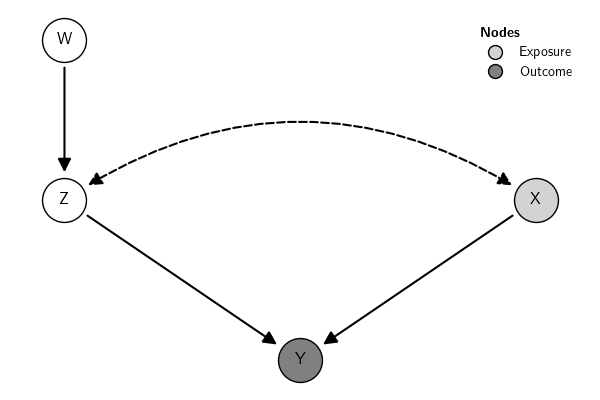

---

hide:

-   toc

---

# Simulate Data

The submodule `simulate` contains many classes that allow simulating
data from specific models. For details, see
[Documentation](../../api/#synthetic-data).

The object with the simulated data contains additional information, such
as the parameter values used in the simulation. Below is an example of
simulated data from a Graphical Model. Here is the graph:

``` {.python exports="both" results="silent" tangle="src-simulate-data.py" cache="yes" noweb="no" session="*Python*" linenums="1" eval="always"}
from causalinf import simulate
from causalinf import gcm

G = gcm.examples(which='Pearl Example 1.1 (a)')
G.plot()
```



To simulate data from a linear structure model based on that graph, use:

``` {.python exports="code" results="silent" tangle="src-simulate-data.py" cache="yes" noweb="no" session="*Python*" linenums="1" eval="always"}
sim = simulate.lsem(G)
```

Here are the data and some relevant pieces of information stored in the
`sim` object:

``` {.python exports="both" results="output code" tangle="src-simulate-data.py" cache="yes" noweb="no" session="*Python*" linenums="1" eval="yes"}
print(sim.data.head())
print(sim.parameters_tidy)
print(sim.parameters)

```

``` python
shape: (5, 6)
┌─────┬─────┬─────┬─────┬─────┬─────┐
│ X   ┆ W   ┆ ('Z ┆ Z   ┆ ('X ┆ Y   │
│ --- ┆ --- ┆ ',  ┆ --- ┆ ',  ┆ --- │
│ f64 ┆ f64 ┆ 'X' ┆ f64 ┆ 'Z' ┆ f64 │
│     ┆     ┆ )   ┆     ┆ )   ┆     │
│     ┆     ┆ --- ┆     ┆ --- ┆     │
│     ┆     ┆ f64 ┆     ┆ f64 ┆     │
╞═════╪═════╪═════╪═════╪═════╪═════╡
│ -0. ┆ -0. ┆ -1. ┆ 1.1 ┆ -1. ┆ -2. │
│ 152 ┆ 037 ┆ 396 ┆ 824 ┆ 686 ┆ 670 │
│ 676 ┆ 366 ┆ 107 ┆ 11  ┆ 375 ┆ 969 │
│ -1. ┆ 0.3 ┆ -0. ┆ 0.2 ┆ 0.7 ┆ -0. │
│ 812 ┆ 930 ┆ 375 ┆ 853 ┆ 808 ┆ 640 │
│ 581 ┆ 66  ┆ 1   ┆ 27  ┆ 26  ┆ 568 │
│ -0. ┆ 0.1 ┆ 1.5 ┆ -0. ┆ 0.7 ┆ 0.5 │
│ 526 ┆ 609 ┆ 953 ┆ 335 ┆ 323 ┆ 109 │
│ 968 ┆ 69  ┆ 47  ┆ 971 ┆ 74  ┆ 91  │
│ 0.5 ┆ -0. ┆ 0.5 ┆ -0. ┆ -0. ┆ -1. │
│ 201 ┆ 620 ┆ 813 ┆ 255 ┆ 617 ┆ 079 │
│ 7   ┆ 632 ┆     ┆ 662 ┆ 521 ┆ 646 │
│ -0. ┆ -0. ┆ 0.4 ┆ 1.2 ┆ 2.5 ┆ -0. │
│ 538 ┆ 094 ┆ 020 ┆ 620 ┆ 424 ┆ 287 │
│ 738 ┆ 038 ┆ 97  ┆ 29  ┆ 33  ┆ 027 │
└─────┴─────┴─────┴─────┴─────┴─────┘
shape: (9, 5)
┌─────┬─────┬─────┬─────┬─────┐
│ lhs ┆ op  ┆ rhs ┆ ter ┆ tru │
│ --- ┆ --- ┆ --- ┆ m   ┆ e   │
│ str ┆ str ┆ str ┆ --- ┆ --- │
│     ┆     ┆     ┆ str ┆ f64 │
╞═════╪═════╪═════╪═════╪═════╡
│ Z   ┆ ~   ┆ 1   ┆ Z ~ ┆ -0. │
│     ┆     ┆     ┆ 1   ┆ 165 │
│     ┆     ┆     ┆     ┆ 468 │
│ Z   ┆ ~   ┆ W   ┆ Z ~ ┆ -0. │
│     ┆     ┆     ┆ W   ┆ 502 │
│     ┆     ┆     ┆     ┆ 682 │
│ X   ┆ ~   ┆ 1   ┆ ('X ┆ 0.5 │
│     ┆     ┆     ┆ ',  ┆ 040 │
│     ┆     ┆     ┆ 'Z' ┆ 96  │
│     ┆     ┆     ┆ ) ~ ┆     │
│     ┆     ┆     ┆ 1   ┆     │
│ Z   ┆ ~   ┆ 1   ┆ ('X ┆ 0.5 │
│     ┆     ┆     ┆ ',  ┆ 040 │
│     ┆     ┆     ┆ 'Z' ┆ 96  │
│     ┆     ┆     ┆ ) ~ ┆     │
│     ┆     ┆     ┆ 1   ┆     │
│ X   ┆ ~   ┆ Z   ┆ ('X ┆ 0.6 │
│     ┆     ┆     ┆ ',  ┆ 655 │
│     ┆     ┆     ┆ 'Z' ┆ 59  │
│     ┆     ┆     ┆ ) ~ ┆     │
│     ┆     ┆     ┆ ('Z ┆     │
│     ┆     ┆     ┆ ',  ┆     │
│     ┆     ┆     ┆ 'X' ┆     │
│     ┆     ┆     ┆ )   ┆     │
│ Z   ┆ ~   ┆ X   ┆ ('X ┆ 0.6 │
│     ┆     ┆     ┆ ',  ┆ 655 │
│     ┆     ┆     ┆ 'Z' ┆ 59  │
│     ┆     ┆     ┆ ) ~ ┆     │
│     ┆     ┆     ┆ ('Z ┆     │
│     ┆     ┆     ┆ ',  ┆     │
│     ┆     ┆     ┆ 'X' ┆     │
│     ┆     ┆     ┆ )   ┆     │
│ Y   ┆ ~   ┆ 1   ┆ Y ~ ┆ 0.2 │
│     ┆     ┆     ┆ 1   ┆ 967 │
│     ┆     ┆     ┆     ┆ 71  │
│ Y   ┆ ~   ┆ X   ┆ Y ~ ┆ 0.1 │
│     ┆     ┆     ┆ X   ┆ 608 │
│     ┆     ┆     ┆     ┆ 65  │
│ Y   ┆ ~   ┆ Z   ┆ Y ~ ┆ -0. │
│     ┆     ┆     ┆ Z   ┆ 601 │
│     ┆     ┆     ┆     ┆ 773 │
└─────┴─────┴─────┴─────┴─────┘
{'X': {}, 'W': {}, ('Z', 'X'): {}, 'Z': {'1': np.float64(-0.16546840218751058), 'W': -0.5026822920154137}, ('X', 'Z'): {'1': np.float64(0.504096131827507), ('Z', 'X'): 0.6655587449937226}, 'Y': {'1': np.float64(0.296771416338508), 'X': 0.1608651106173018, 'Z': -0.6017725406975072}}
```

```{=latex}

$$
\begin{array}{lccr}
\toprule
\text{Method} & \text{Accuracy} & \text{F1-Score} & \lambda \text{ value} \\
\midrule
\text{SoO}^{\ast} & 0.95 & 0.92 & 10^{-3} \\
\text{IV} & 0.89 & 0.85 & 5 \times 10^{-4} \\
\text{DiD} & 0.91 & 0.88 & 10^{-2} \\
\bottomrule
\end{array}
$$
```
